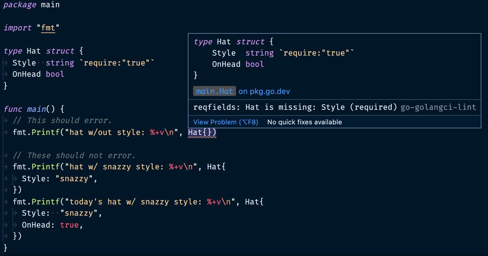

# go-reqfields

Go linter for missing required struct fields.



## Installation

```sh
go get github.com/colinking/go-reqfields
```

## Usage

```sh
go run ./cmd/reqfields <pkg | file>
```

```sh
# Example:
go run ./cmd/reqfields ./fixtures/ex1
```

## IDE Integration

You can configure your editor to provide lint warnings from `go-reqfields` via `golangci-lint`.

To do that, first download this repo and run `go generate ./...`. This will generate a Go plugin that `golangci-lint` will use.

Then, add a `.golangci.yml` to your repo with the following configuration:

```yaml
linters-settings:
  custom:
    reqfields:
      # Make sure to update this path to point at your local copy of `colinking/go-reqfields`:
      path: ./cmd/plugin/main.so
      description: Compile-time warnings for required fields.
      original-url: github.com/colinking/go-reqfields

linters:
  enable:
    - reqfields
```

Finally, configure your editor to use `golangci-lint`. For example in VSCode, you add the following to your settings file:

```json
"go.lintTool": "golangci-lint",
"go.lintFlags": ["--fast"],
```
